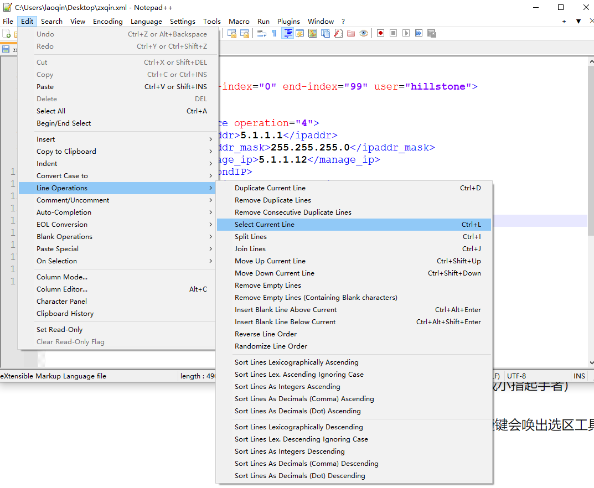
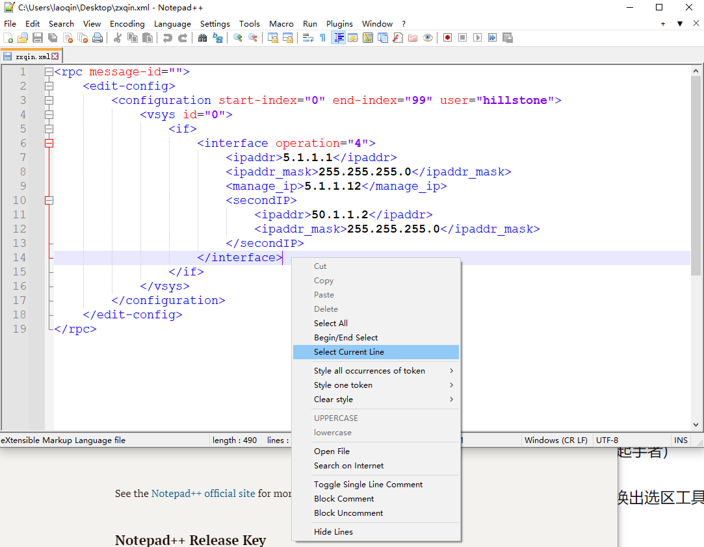
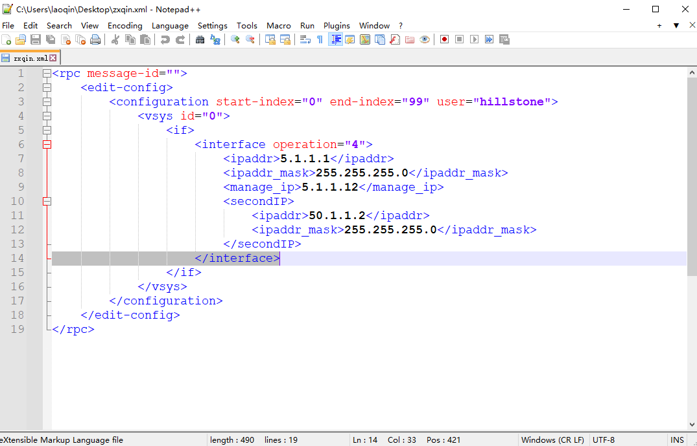

Add Some New Features&nbsp;&nbsp;
===================

Due to personal habits, some common operations do not have shortcut keys, so I fork the repo and modify it to meet personal needs.

Here add some new features for Notepad++.

## 1.select current line

In personal preference, Selecting current line  is a very frequent operation. However, Notepad++ has no operations can meet this needs completely.

(split lines operation can meet my needs sometimes, but it will split one line to multiple lines when this line is longer than window size.)

Here are some screenshots:

**1.I add it to Menu `Edit->Line Operation->Select Current line`, add set the short key as `ctrl+L`.**

(ps: `cut line` is `ctrl+L` and conflict with the key I add originally, so I change default key of `cut line` to `ctrl+alt+L` in source code).

**2.Mouse right key add it.**

short key is `ctrl+L`,like this: 

# Release Zip

I upload a Zip to Release Page, so that you can use it directly.

Or you can build it yourself.