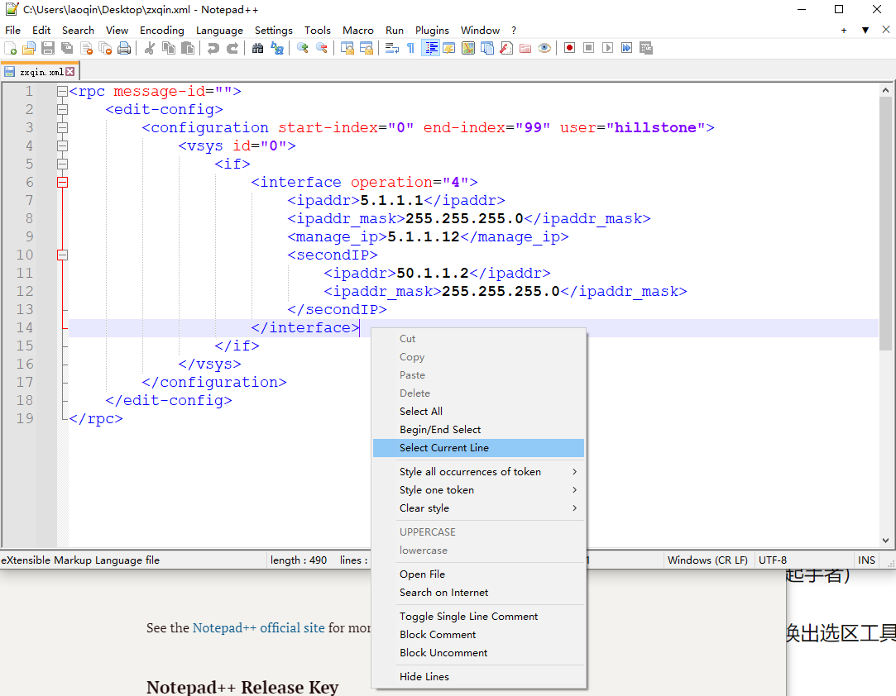

增加了一些新特性
===================

出于个人习惯，部分常用操作没有快捷键，因此fork过来修改下满足个人需要。

这里为Notepad++添加了一些新特性.

## 1.选择当前行

出于个人习惯，选择当前行是一个经常用的操作，但目前notepad++没有操作能完全满足。

（其实split line操作有时可以满足需要，但是当一行过长，以至于超过档期那窗口的大小时，split line操作就会把当前行分割成多行。）

下面是一些截图和说明：

**1.  我把此操作加入到了菜单栏中： `Edit->Line Operation->Select Current line`, 并且把快捷键设置为 `ctrl+L`.**

(ps: notepad++原来的`cut line` 即`剪切行`操作的快捷键是is `ctrl+L` ，它跟我要设置的选择当前行的快捷键冲突了，所以我在代码里把`cut line`默认的快捷键修改成了  `ctrl+alt+L`。

**2.鼠标右键菜单也添加了此操作**

快捷键是 `ctrl+L`，如下图: 

# Release Zip

我把编译好的可执行文件打包到了Release Page，所以可以直接下载用。

或者也可以自行编译构建生成。